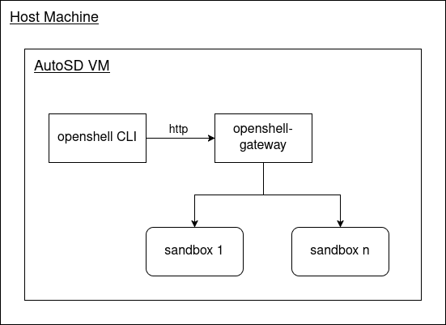
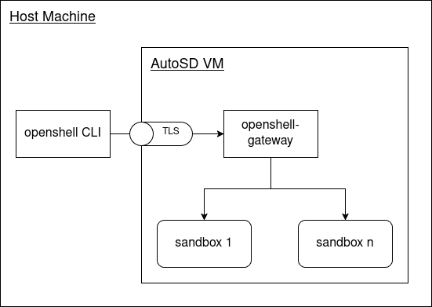
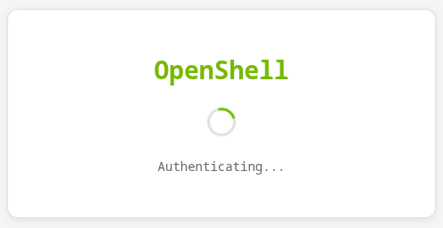
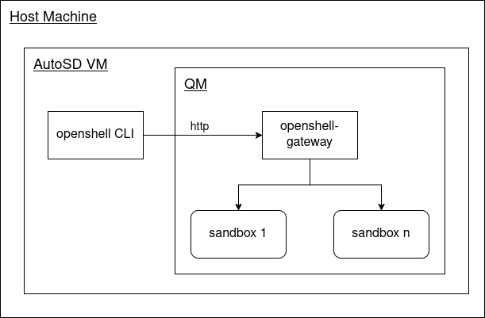

# OpenShell on AutoSD

The following sections show some examplary image builds applying [NVIDIA/OpenShell](https://github.com/NVIDIA/OpenShell) in [Red Hat AutoSD](https://sig.centos.org/automotive/latest/).

## Pinning versions

OpenShell is currently in its alpha phase, thus under heavy development, moving fast and breaking things frequently. If the latest version of OpenShell would be used in this demo frequent adaptions of all the changes would be required. In order to have a more stable (technical) demo, the following versions of OpenShell artifacts are being used in this demo:

- openshell and openshell-gateway: **v0.0.43**
- openshell supervisor image: **14c5329f91d8f7c60e6274465bb1e246156074e7**
- openshell sandbox image (base): **db19652**


## Preparing the build(s)

Before the image with [automotive-image-builder](https://gitlab.com/CentOS/automotive/src/automotive-image-builder/) can be built, the RPM packages with the required version need to be built. 

Clone the `NVIDIA/OpenShell` repository and checkout to the recommended git tag:

```bash
$ git clone git@github.com:NVIDIA/OpenShell.git
$ cd OpenShell
$ git checkout v0.0.43 
```

Run the [build](./build) script with the `setup` command: 

```bash
# <path>: Local path to git repository of OpenShell
$ ./build setup <path>
...
```

It will build the OpenShell RPM packages for the specific version, create the local RPM repository in [./rpms](./rpms/) (consumed by the aib build) and generate the necessary TLS certificates in [./aib/files/pki](./aib/files/pki/).


## Demos: Overview

Three different setups for OpenShell on an AutoSD image have been investigated:

| Setups | Description | Section Link |
|---|---|---|
| No TLS | `openshell-gateway` is running in the **root partition** with TLS **disabled**. `openshell` CLI is executed on the **root partition** as well.  | [link](#demo-openshell-in-root-partition-with-tls-disabled) |
| TLS | `openshell-gateway` is running in the **root partition** with TLS **enabled**. `openshell` CLI is executed on a remote machine, e.g. the **host machine** running the AutoSD VM. | [link](#demo-openshell-in-root-partition-with-tls-enabled) |
| QM | `openshell-gateway` is running in the **QM partition** with TLS **disabled**. `openshell` CLI is executed on the **root partition**. | [link](#demo-openshell-in-qm-partition) |


## Demo: OpenShell in root partition with TLS disabled

In this demo, the AutoSD image is built to contain the OpenShell components directly on its **root partition** with TLS disabled.



### Building the demo

For the [openshell-autosd-no-tls.aib.yml](./aib/openshell-autosd-no-tls.aib.yml) demo run:

```bash
$ ./build build-demo-no-tls
```

After the build completes (this might take a while), the final image is stored as `openshell-autosd-no-tls.aib.x86_64.img`.

### Running the demo

For running the built image, `automotive-image-builder`s **air** tool can be used:

```bash
# Note: this might require sudo privileges
$ air openshell-autosd-no-tls.aib.x86_64.img
```

After the VM has successfully booted, either login directly or open another terminal and use SSH to connect to it:

```bash
$ ssh -p 2222 -o StrictHostKeyChecking=no -o UserKnownHostsFile=/dev/null root@localhost
```

**Note:** The password can be found in the [aib manifest](./aib/openshell-autosd-no-tls.aib.yml#L65).

Using the `openshell` CLI, lets create a sandbox:

```bash
# Verify the gateway is running
$ systemctl is-active openshell-gateway
active

# Adding the local gateway and checking the status
$ openshell gateway add http://127.0.0.1:8080 --local
$ openshell status
Server Status

  Gateway: openshell
  Server: http://127.0.0.1:8080
  Status: Connected
  Version: 0.0.43

# Create a new sandbox (base image)
# Claude is already pre-installed, but would need an API Key as an environment 
# variable on the host to get injected into the sandbox (not part of this demo)
$ openshell sandbox create

Created sandbox: summary-coonhound

sandbox@sandbox-summary-coonhound:~$
```


## Demo: OpenShell in root partition with TLS enabled

In this demo, the AutoSD image is built to contain the `openshell-gateway` directly on its **root partition** with TLS enabled and the `openshell` CLI being used on the **host machine**.



### Building the demo

For the [openshell-autosd-tls.aib.yml](./aib/openshell-autosd-tls.aib.yml) demo run:

```bash
$ ./build build-demo-tls
```

After the build completes (this might take a while), the final image is stored as `openshell-autosd-tls.aib.x86_64.img`.

### Setting up the CLI on the host machine

Before the `openshell` CLI can be used with the `openshell-gateway` using TLS, the generated certificates need to be installed. These were created as part of the [Preparation step](#preparing-the-builds) and should be located in [./aib/files/pki/](./aib/files/pki/).

```bash
# Add the generated CA as trust anchor
$ cp <demo-dir>/aib/files/pki/mtls/ca.crt /etc/pki/ca-trust/source/anchors/openshell.crt
$ update-ca-trust
```

In addition, add the [./aib/files/pki/mtls/openshell.p12](./aib/files/pki/mtls/openshell.p12) to the default browser. For example, in Chromium simply open `chrome://certificate-manager/clientcerts/platformclientcerts` and import the `openshell.p12` certificate.

### Running the demo

For running the built image, `automotive-image-builder`s **air** tool can be used:

```bash
$ air --port-forward 8888:8080 openshell-rhivos-tls.aib.x86_64.img
```

Note that the host port 8888 is mapped to the VM port 8080 here. The `openshell-gateway` is listening inside the VM on port 8080 and port 8888 will be used by the `openshell` CLI on the host machine later. Lets add the gateway by running **on the host machine**:

```bash
$ openshell gateway add https://127.0.0.1:8888
✓ Gateway 'openshell' added and set as active
  Endpoint: https://127.0.0.1:8888
  Type: cloud

  Confirmation code: 36D-UGQQ
  Verify this code matches your browser before clicking Connect.

Press Enter to open the browser for authentication...
Browser opened.
```

After the page has been opened in the browser the authentication page (see below) can safely be closed and the `openshell` command aborted. The reply from the gateway is currently not handled, but the login should succeed anyway (even when a "Timeout" occurs)



After the authentication procedure, `openshell` CLI can be used to manage sandboxes as shown in [Running the demo (no TLS)](#running-the-demo) section.


## Demo: OpenShell in QM partition

In this demo, the AutoSD image is built to contain the `openshell-gateway` in its **QM partition** with TLS disabled and the `openshell` CLI being used on the **root partition**.



### Building the demo

For the [openshell-autosd-qm.aib.yml](./aib/openshell-autosd-qm.aib.yml) demo run:

```bash
$ ./build build-demo-qm
```

After the build completes (this might take a while), the final image is stored as `openshell-autosd-qm.aib.x86_64.img`.

### Running the demo

For running the built image, `automotive-image-builder`s **air** tool can be used:

```bash
# Note: this might require sudo privileges
$ air openshell-autosd-qm.aib.x86_64.img
```

After the VM has successfully booted, either login directly or open another terminal and use SSH to connect to it:

```bash
$ ssh -p 2222 -o StrictHostKeyChecking=no -o UserKnownHostsFile=/dev/null root@localhost
```

**Note:** The password can be found in the [aib manifest](./aib/openshell-autosd-qm.aib.yml#L79).

Using the `openshell` CLI, the gateway in QM can be added. However, it currently **fails for creating sandboxes**. This error needs further investigation:

```bash
# Verify the gateway is running in QM
$ podman exec qm systemctl is-active openshell-gateway
active

# Adding the local gateway and checking the status
$ openshell gateway add http://127.0.0.1:8080 --local
$ openshell status
Server Status

  Gateway: openshell
  Server: http://127.0.0.1:8080
  Status: Connected
  Version: 0.0.43

# Create a new sandbox (base image) - it currently fails inside QM
$ openshell sandbox create
Error:   × status: Internal, message: "create sandbox failed: podman API error (500): netavark (exit code 1): set sysctl net/ipv4/ip_forward: IO error: Read-only file system (os
  │ error 30)", details: [], metadata: MetadataMap { headers: {"content-type": "application/grpc", "date": "Wed, 27 May 2026 07:29:24 GMT", "x-request-id": "ddbadcd4-d0b2-
  │ 4aa8-9f4d-1fb1dff9c63d"} }
```
